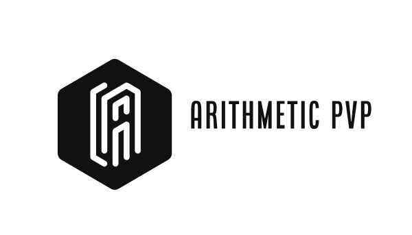

[![Contributors][contributors-shield]][contributors-url]  [![Forks][forks-shield]][forks-url] [![Stargazers][stars-shield]][stars-url]


<!-- PROJECT LOGO -->
<br />
<p align="center">
  <a href="https://github.com/shabalin13/Arithmetic-PvP">
    
  </a>

  <p align="center">
    Multiplayer verbal counting game
    <br />
    <a href="https://github.com/shabalin13/Arithmetic-PvP"><strong>Explore the docs »</strong></a>
    <br />
    <br />
    <a href="https://github.com/shabalin13/Arithmetic-PvP">View Demo</a>
    ·
    <a href="https://github.com/shabalin13/Arithmetic-PvP/issues">Report Bug</a>
    ·
    <a href="https://github.com/shabalin13/Arithmetic-PvP/issues">Request Feature</a>
  </p>
</p>


<!-- TABLE OF CONTENTS -->

  <summary><h2 style="display: inline-block">Table of Contents</h2></summary><details open="open">
  <ol>
    <li>
      <a href="#about-the-project">About The Project</a>
      <ul>
        <li><a href="#built-with">Built With</a></li>
      </ul>
    </li>
    <li>
      <a href="#getting-started">Getting Started</a>
      <ul>
        <li><a href="#prerequisites">Prerequisites</a></li>
        <li><a href="#installation">Installation</a></li>
      </ul>
    </li>
    <li><a href="#usage">Usage</a></li>
    <li><a href="#contacts">Contact</a></li>
    <li><a href="#acknowledgements">Acknowledgements</a></li>
  </ol>
</details>


<!-- ABOUT THE PROJECT -->
## About The Project

Arithmetic PvP is a verbal counting online game. Players compete in calculating various expressions, starting from primitive ones, such as 2+2, ending with extremely hard containing several-digit numbers. There is also a single-player mode, where you can run the endless mode and constantly improve your skill, or play campain which has levels of increasing complexity. 


### Built With

* [Bootstrap](https://getbootstrap.com/)
* [Vue.js](https://vuejs.org/)
* [Django REST API](https://www.django-rest-framework.org/)


<!-- GETTING STARTED -->
## Getting Started

To get a local copy up and running follow these simple steps.

### Prerequisites

This is an example of how to list things you need to use the software and how to install them.
* npm
  ```sh
  npm install npm@latest -g
  ```

### Installation

1. Clone the repo
   ```sh
   git clone https://github.com/shabalin13/Arithmetic-PvP.git
   ```
2. Install NPM packages
   ```sh
   npm install
   ```


<!-- USAGE EXAMPLES -->
## Usage

Play our game if you want to:

* Improve your arithmetic skills
* Find new friends with same interests
* Compete!

_For more examples, please refer to the [Documentation](https://docs.google.com/document/d/1IW7qtScCkux4zSTebuYHjDHVmJViEZk8az48_3F7OXM/edit)_


<!-- CONTACTS -->
## Contacts

Collaborators - Kamil Agliullin, Aidar Khuzin, Dmitrii Shabalin, Evgeny Petrashko

Project Link: [https://github.com/shabalin13/Arithmetic-PvP](https://github.com/shabalin13/Arithmetic-PvP)


<!-- MARKDOWN LINKS & IMAGES -->
<!-- https://www.markdownguide.org/basic-syntax/#reference-style-links -->
[contributors-shield]: https://img.shields.io/github/contributors/shabalin13/Arithmetic-PvP.svg?style=for-the-badge
[contributors-url]: https://github.com/shabalin13/Arithmetic-PvP/graphs/contributors
[forks-shield]: https://img.shields.io/github/forks/shabalin13/Arithmetic-PvP.svg?style=for-the-badge
[forks-url]: https://github.com/shabalin13/Arithmetic-PvP/network/members
[stars-shield]: https://img.shields.io/github/stars/shabalin13/Arithmetic-PvP.svg?style=for-the-badge
[stars-url]: https://github.com/shabalin13/Arithmetic-PvP/stargazers
[license-shield]: https://img.shields.io/github/license/shabalin13/Arithmetic-PvP.svg?style=for-the-badge

